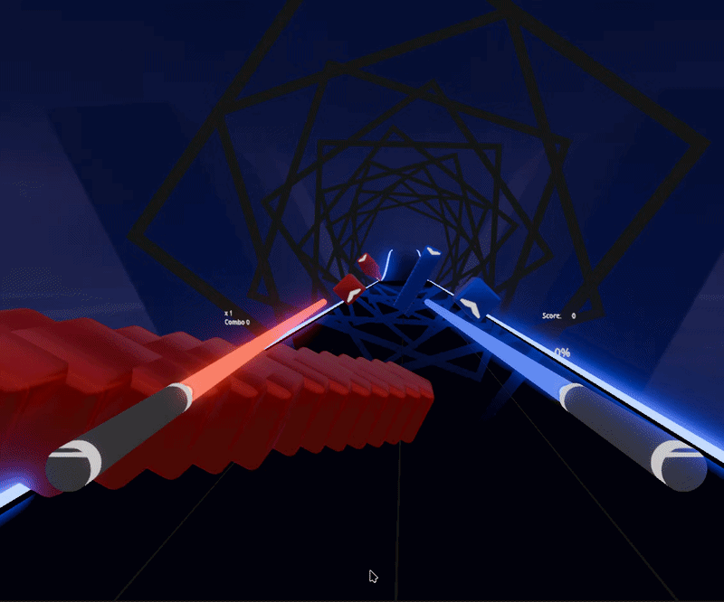

# Open Slice
This is a fork of [Open Saber by LeandroDreamer](https://github.com/leandrodreamer/BeepSaber) which is a fork of [Beep Saber by NeoSpark314](https://github.com/NeoSpark314/BeepSaber) ported to Godot 4.7, with more modchart support.

This fork tries to improve the experience, graphics and aims to make it more of it's own game instead of just a demo.

This project should support all OpenXR supported devices

### This fork uses a simplified scoring system:

5 points for **accuracy**,

and another 5 points for **controller movement** since the last note(**subject to change**).

This system was chosen to make 100%ing a map realistic

(gif showing off the map [Centipede by NiceToMeetYou](https://beatsaver.com/maps/4e8d))

(gif showing off the map [Boy's a liar Pt. 2 by August](https://beatsaver.com/maps/30a1f))

# About the implementation
This game uses godot 4.7. The implementation supports to load and play maps from [BeatSaver](https://beatsaver.com/).
Mapping Extentions and chroma support are available thanks to VSjnk, and noodle extentions support is currently being worked on
To export for android headsets the godot openxr vendors plugin may be needed

There is one demo song included that is part of the deployed package.

You can play custom songs by downloading them in the in-game menu. 

## Current Progress:
- **Mapping Extentions**: fully working
- **Chroma**: working partially(chroma enhancements cant be added)
- **Noodle Extentions**: highly unfinished
- **Vivify**: remains a dream... (although this exists https://github.com/V-Sekai/unidot_importer, so partial support may be possible)

# Credits
The included Music Track is Time Lapse by TheFatRat (https://www.youtube.com/watch?v=3fxq7kqyWO8)

# Licensing
This repository is licensed under the MIT license
